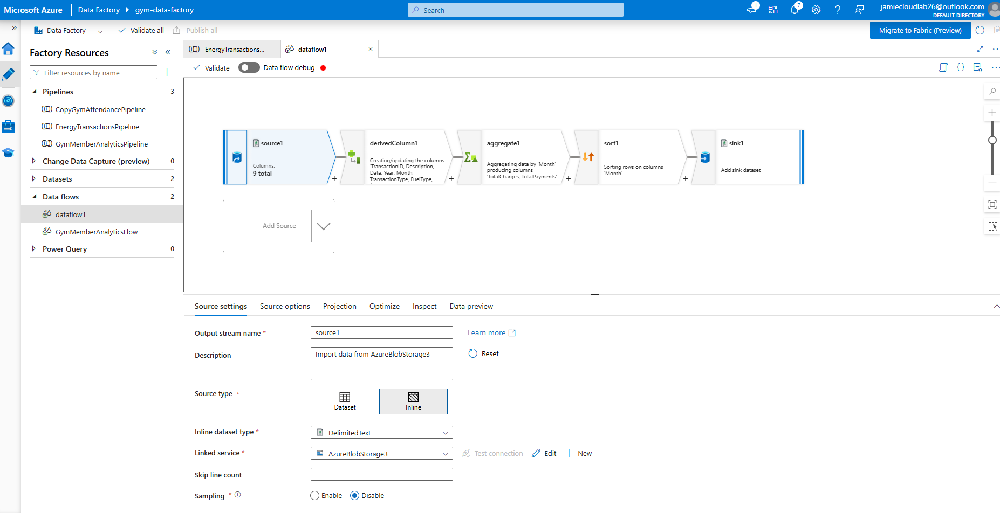
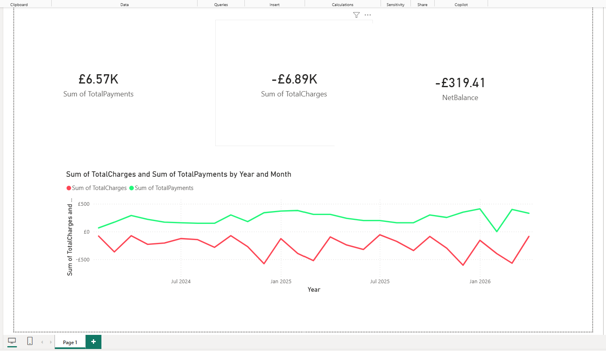

# 📊 Energy Analytics Pipeline (Azure Data Factory + Synapse + Power BI)

A real-world data engineering project analysing energy transactions using a modern Azure data stack.

## 🏗️ Architecture

Python → Azure Blob Storage → Azure Data Factory → Synapse Serverless → Power BI

## 📌 Overview
This project demonstrates an end-to-end data pipeline that ingests, transforms, and analyses energy transaction data.

## 🎯 Project Goal
The goal of this project is to simulate a real-world energy billing scenario by:
- Tracking charges and payments  
- Analysing monthly spending trends  
- Calculating net balance over time  

## 🛠️ Technologies Used
- Azure Data Factory
- Azure Blob Storage (Data Lake)
- Azure Synapse Analytics (Serverless SQL)
- SQL (OPENROWSET, Views, Aggregations)
- Python (pandas, Azure SDK)
- Power BI
- Git & GitHub

🐍 Python Automation
A Python script is used to securely upload raw CSV data to Azure Blob Storage using Azure Identity authentication.

## 🔄 Data Pipeline
1. Raw CSV data prepared locally
2. Python script uploads data to Azure Blob Storage (data lake)
3. Azure Data Factory ingests and transforms data
4. Cleaned data stored in a processed (curated) layer
5. Azure Synapse Serverless used to query data directly from the data lake using OPENROWSET
6. Schema defined using SQL WITH clause
7. Created reusable views:
   - `vw_energy_data` (cleaned dataset)
   - `vw_monthly_summary` (aggregated reporting layer)
8. Power BI connects to Synapse for reporting and visualisation

## 🧠 Data Modelling (Synapse)

Two SQL views were created to structure the data:

### `vw_energy_data`
- Represents cleaned transaction-level data
- Defines schema over raw CSV using OPENROWSET

### `vw_monthly_summary`
- Aggregated monthly dataset
- Includes:
  - total_charges
  - total_payments
  - net_balance

This approach separates raw data from reporting logic, following best practices used in modern data engineering pipelines.

## ▶️ How to Run This Project
1. Prepare CSV data locally
2. Run Python script to upload data to Azure Blob Storage
3. Run Data Flow to transform data
4. Load processed data into Power BI
5. Build dashboard using transformed dataset

## 📊 Power BI Energy-Project-PowerBi-Dashboard
The dashboard provides:
- Monthly trend of energy spending vs payments  
- Total charges and total payments  
- Net balance (overall position)

- ## 📊 Power BI Dashboard-1 (Synapse)
The dashboard connects to Azure Synapse Serverless using the `vw_monthly_summary` view and includes:

- KPI Cards:
  - Total Charges  
  - Total Payments  
  - Net Balance  

- Line Chart:
  - Monthly Net Balance Trend  

- Bar Chart:
  - Charges vs Payments by Month  

## 🔑 Key Features
- End-to-end ETL pipeline  
- Conditional transformations and aggregation logic  
- Real-world financial-style dataset  
- Interactive dashboard for analysis  

## 📸 Screenshots

### Azure Data Factory Pipeline

### 🧠 Synapse Query Layer

### Power BI Dashboard

## 📚 What I Learned
- Designing and building an end-to-end ETL pipeline in Azure
- Implementing data transformations and aggregations using Data Flows
- Handling schema inconsistencies and data quality issues
- Creating interactive dashboards in Power BI for business insights

## 🚀 Future Improvements
- Enhance Python script for data validation and preprocessing
- Implement scheduled pipeline triggers
- Expand dashboard with advanced analytics and KPIs
